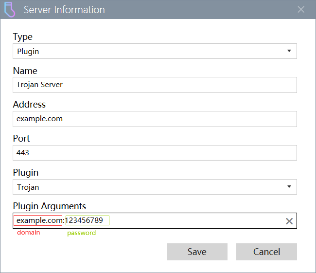

# TrojanPlugin
A Win2Socks Plugin to support [Trojan](https://trojan-gfw.github.io/trojan/) protocol.

一个 Win2Socks 插件以支持 [Trojan](https://trojan-gfw.github.io/trojan/) 协议。

# Download
https://win2socks.com/downloads/TrojanPlugin.zip

# Install
Select the `Plugins` view of Win2Socks, click the `Install Plugins...` button, select the packaged plugin zip file, and restart Win2Socks.

打开 Win2Socks 的 `插件` 页面，点击 `安装插件 ...` 按钮，选择打包好的插件压缩包文件后，重启 Win2Socks 即可。

# Arguments
The plugin arguments consist of the `domain` of your server and the `password` used for verification, separated by `:`.

插件参数由你的服务器的 `域名` 和用于验证的 `密码` 组成，中间用 `:` 分隔。

